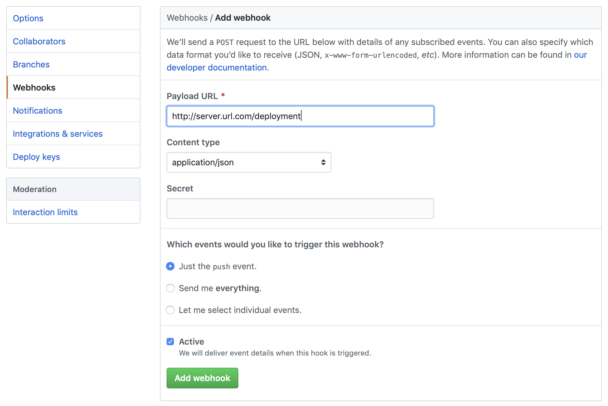

# Autodeploy
VERSION : 0.1 [UNSTABLE]

git push를 하면 서버가 repository를 자동으로 clone / pull을 해서 내부의 Dockerfile을 기반으로 서버를 빌드한 후에 3000번 포트로 배포를 해준다.

## 지원 예정

**현재 PUSH를 하기만 하면 DEPLOY  가 됩니다. 주의하세요. **

**현재는 MASTER 브랜치만 가능합니다. 그러나 다른 브랜치를 푸시하더라도 디플로이 과정이 재실행됩니다. fork 떠온 Private 레포의 master branch 에다가 파일을 올려놓아도, 풀리퀘스트만 안보낸다면, 원본 저장소에는 아무 문제가 없으므로 이 소프트웨어를 사용하는데에는 브랜치에 따른 지장이 없을 것입니다. (브랜치 지정할 수 있도록 바꿔야함)**


## 사용 방법 

**NOTICE: [install.sh] 현재는 CENTOS 7만 확인했습니다. UBUNTU는 현재 자동 설치 스크립트가 없습니다.**

### 서버 설정

80번 포트만 개방하면 된다. 나머지 설정은 유저에게 맡깁니다.

### Centos

**NOTICE: 하단의 명령어는 잘 안될 수도 있습니다. 직접 수행하시는게 더 나을 수도 있습니다. 모든 명령 및 스크립트는 root 권한에서 실행한다는 가정 하에 개발했습니다.**

```shell
yum update -y & yum upgrade -y
yum install git
```
위의 명령어가 선행되어야 한다. EC2 등의 container를 만들고 나면 꼭 위의 명령어를 실행해서 최신 버전으로 만들면 좋다.

```shell
git clone "this repository"
```

클론을 한 뒤, 클론 한 repository로 이동한다.

```shell
/bin
	ㄴ 실행 스크립트 저장
/deployserver
	ㄴ deploy 서버 Dir
```

먼저 /bin으로 가서 ./install.sh를 수행한다.

```shell
chmod +x ./install.sh //실행 권한을 줘야함.
./install.sh
```

install.sh 는 **nginx**와 **nodejs:10.16.3**, **docker**를 설치합니다. 만약 오류가 생긴다면 직접 설치해주세요...

Nginx - https://www.nginx.com/resources/wiki/start/topics/tutorials/install/

Nodejs - https://github.com/nodesource/distributions/blob/master/README.md

docker (Centos) -  https://docs.docker.com/install/linux/docker-ce/centos/

완료된다면, /deployserver 로 이동한다.

```shell
npm install
node app.js
```

의존성 패키지 설치한 뒤에, 서버를 실행합니다. 서버는 20000 번 포트를 이용합니다.


###Ubuntu

**아직 설치 스크립트를 제작하지 않았습니다. 상단의 Centos와 동일한 설치 과정을 걸쳐 설치해주세요.**


### Dockerfile

https://github.com/FullOfOrange/deploy_test/

예시용 repository를 만들었습니다. 이곳에 있는 Dockerfile에 명시되어있는 주석을 기준으로 작성해주세요.

```dockerfile
# --- FROM 명령어가 최상단에 위치하여야 합니다.
FROM node:10.16.3

RUN pwd
COPY node-project/package.json /src/package.json
# --- 미리 npm install 을 실행할 수 있습니다.
RUN cd /src; npm install

COPY node-project /src

WORKDIR /src

# --- 꼭 서버가 켜지면 실행할 명령어를 입력해야 합니다.
# --- 예를 들면 서버를 켜는 명령어 등등
# --- 이런 run 명령어가 있어야 Docker 가 run 이 되면 서버가 실행됩니다.
CMD node index.js

# --- [필수] 3000번 포트만 지원 가능합니다.
EXPOSE 3000
```


### WEB Hooks



각각의 레포지토리마다 Webhooks가 있다. 설정한 서버의 URL 을 정의해서 /deployment에 연결해주면 된다.


### Private Repo

private repository 를 위해 옵션 형식으로 아이디와 비밀번호를 줄 수 있다.

./deployserver/options/userinfo.js

```javascript
mdule.exports = {
    //github id 와 pw를 넣어주세요.
    //만약 user info를 넣고싶지 않을경우,
    //또는 git에 직접적으로 설정하실경우, 아래의 부분을 건들지 말아주세요.
    id: '',
    pw: ''
}
```

이곳의 ' ' 내에 아이디와 비밀번호를 넣어놓으면 된다. 만약 기여시에 개인정보가 걱정된다면 .gitignore에 이 항목을 추가하세요.


## 작동 방식

#### nginx config

```nginx
events { }
http {
        server {
                listen 80;

                location / {
                        proxy_pass http://$server_addr:3000;
                }
                location /deployment {
                        proxy_pass http://$server_addr:20000/;
                }
        }
}
```

- '/'  3000번 포트로 열려있는 프로젝트로 이동시킨다. 실질적인 APP 서버 역할
- '/deployment' 는 20000 포트를 이용하며, github에서 보내는 Webhooks를 받아오는 역할,  APP 서버에서는 deployment 라우터를 사용할 수 없다. 필요하다면 이 라우터를 변경하면 된다.

 nginx.conf 파일이며 추가적인 location 설정을 하면 된다.
